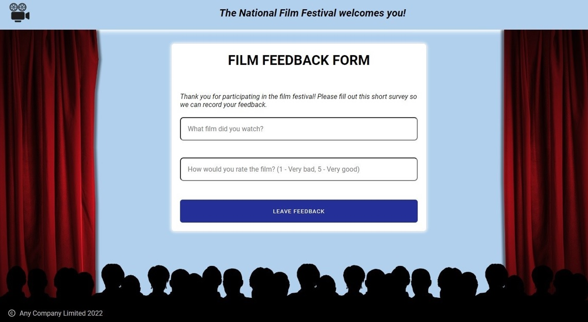

# Survey Application

## Deployment

[](https://app.netlify.com/sites/survey-application/deploys)

Link to deploy: https://survey-application.netlify.app/main

## Project Structure

All network requests are mocked with the service worker.  
**`Technologies`**: React, Typescript, React-router-dom, Redux, Redux-saga, Reselect, Styled Components, React-hook-form.

The project structure looks like the following:

```text
test-movie-survey/src
    ├─ assets
    ├─ components
    ├─ configs
    ├─ constants
    ├─ models
    ├─ pages
    │   ├─ Main
    |   └─ Result
    ├─ router
    ├─ services
    ├─ store
    │   ├─ actions
    │   ├─ reducers
    │   ├─ sagas
    │   ├─ selectors
    |   └─ index.ts
    ├─ styles
    └─ utils
        ├─ hooks
        └─ helpers
```

## Demo screenshot



## Scripts

### `npm install`

To install all the project dependencies.

### `npm start`

To run the application in development mode.\
Open [http://localhost:3000/](http://[::1]:3000/) to access application.

### `npm build`

To build the app for production in the `dist` directory.

### `npm lint`

To run linter in development mode.

### `npm lint:fix`

To run linter in development mode and fix errors automatically.
